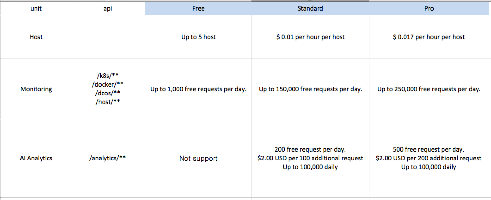
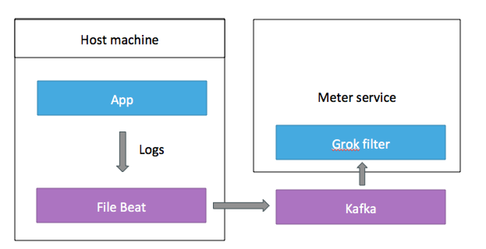
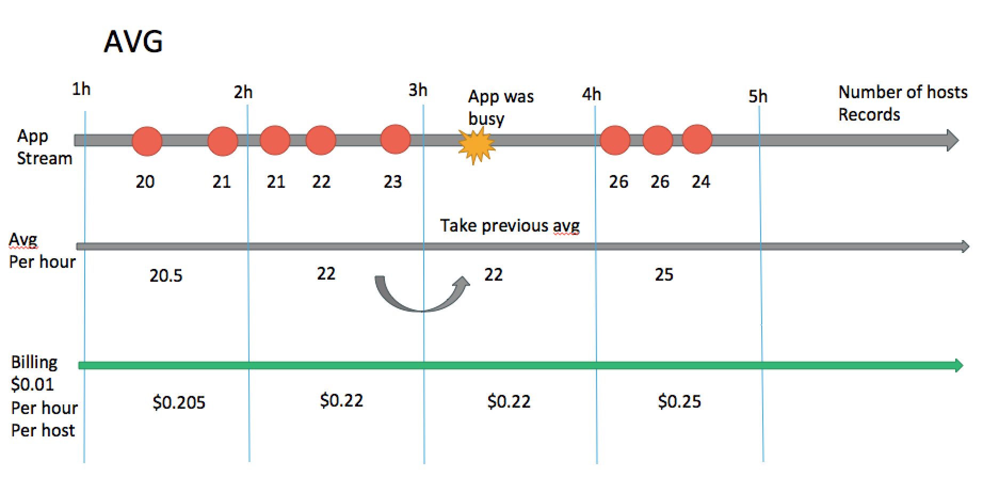
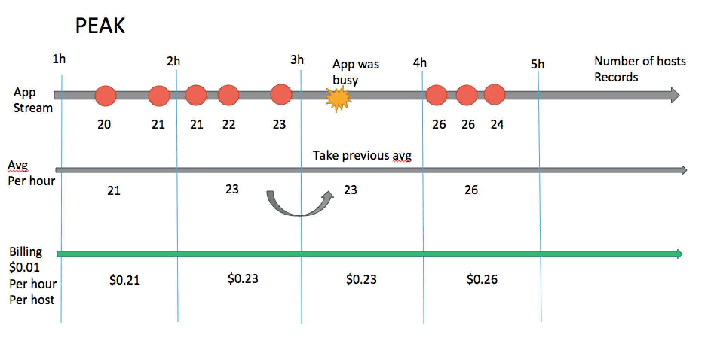
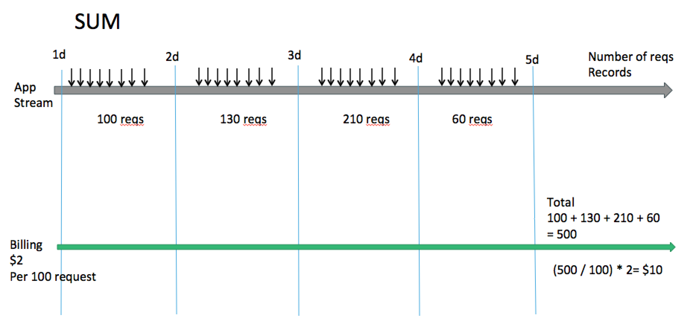
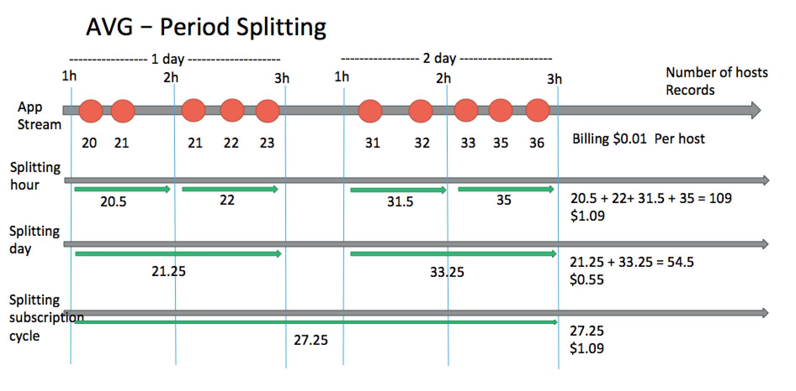
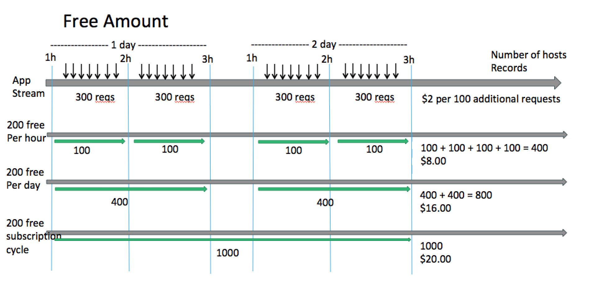
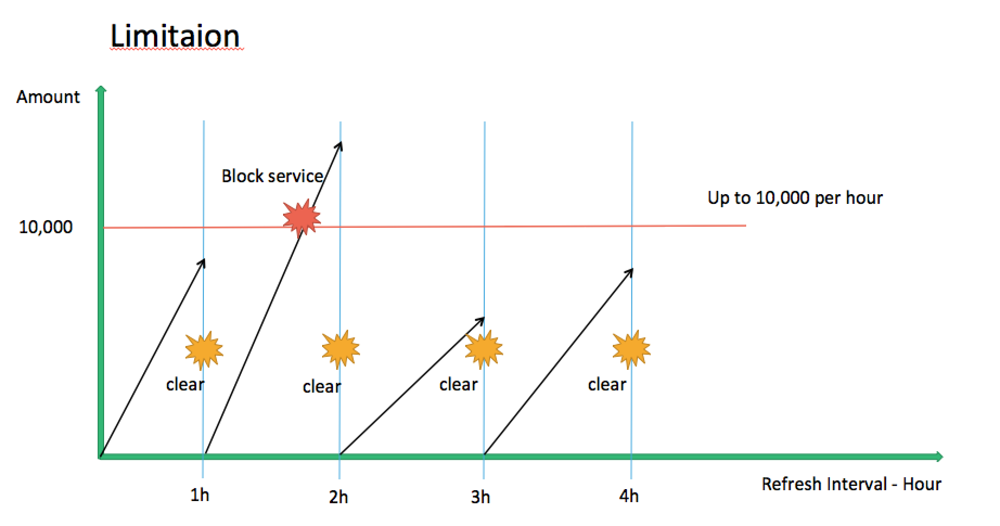

# Concept

**Many subscription-based billing platforms support usage-based billing.
  However, companies still need to be able to measure usage and inform the platform of the exact amount.**

In a traditional usage aggregation method, the batch process was run at the daily or monthly settlement time to display the customer's usage.

In modern microservice architectures, service delivery filtering for most customer levels occurs at the API gateway, and sometimes the microsecurity service itself queries the user charging status and decides whether to provide the service.

In service models that generate revenue from computing usage, API requests, etc. (or other billing models that require real-time responsiveness)
After the service provisioning, it is necessary to query the data center every time the user is charged or consumed, which causes the performance degradation of the whole system.

In order to solve this problem, if you implement cache for every service, it will cause a decrease in development performance and an increase in system complexity.

**Therefore, you need independent services that can collect usage or provide usage information 
without affecting the source code of existing applications, 
and should be available as a simple Kafka integration or agent installation.**

**First of all, in the process of user billing / usage inquiry in the application
    The objective is to process the incoming usage stream in real time and respond within a few milliseconds 
    without compromising existing performance.**
 

## Use Case

Let's take a company as an example. 
The company specializes in cloud monitoring and provides AI-based anomaly detection api as a business strategy item.

The company considered the following revenue model:




### Catalog

In this section, the units receiving money are host and ai-analytics, and are divided into standard and pro plans.

Therefore, first set up a plan that allows the billing platform(killbill) to receive these charges:

`Killbill Catalog`

```
<catalog xmlns:xsi="http://www.w3.org/2001/XMLSchema-instance"
         xsi:noNamespaceSchemaLocation="CatalogSchema.xsd ">

    <effectiveDate>2018-10-08T00:00:00+00:00</effectiveDate>
    <catalogName>NexCloud</catalogName>

    <recurringBillingMode>IN_ADVANCE</recurringBillingMode>

    <currencies>
        <currency>USD</currency>
    </currencies>

    <units>
        <unit name="host"/>
        <unit name="analytics"/>
    </units>

    <products>
        <product name="NexCloud">
            <category>BASE</category>
        </product>
    </products>

    <rules>
        <changePolicy>
            <changePolicyCase>
                <policy>IMMEDIATE</policy>
            </changePolicyCase>
        </changePolicy>
        <changeAlignment>
            <changeAlignmentCase>
                <alignment>START_OF_SUBSCRIPTION</alignment>
            </changeAlignmentCase>
        </changeAlignment>
        <cancelPolicy>
            <cancelPolicyCase>
                <policy>IMMEDIATE</policy>
            </cancelPolicyCase>
        </cancelPolicy>
        <createAlignment>
            <createAlignmentCase>
                <alignment>START_OF_BUNDLE</alignment>
            </createAlignmentCase>
        </createAlignment>
        <billingAlignment>
            <billingAlignmentCase>
                <productCategory>ADD_ON</productCategory>
                <alignment>BUNDLE</alignment>
            </billingAlignmentCase>
            <billingAlignmentCase>
                <alignment>ACCOUNT</alignment>
            </billingAlignmentCase>
        </billingAlignment>
    </rules>

    <plans>
        <plan name="standard-monthly">
            <product>NexCloud</product>
            <finalPhase type="EVERGREEN">
                <duration>
                    <unit>UNLIMITED</unit>
                </duration>
                <usages>
                    <usage name="usage-monthly-in-standard" billingMode="IN_ARREAR" usageType="CONSUMABLE">
                        <billingPeriod>MONTHLY</billingPeriod>
                        <tiers>
                            <tier>
                                <blocks>
                                    <tieredBlock>
                                        <unit>host</unit>
                                        <size>1</size>
                                        <prices>
                                            <price>
                                                <currency>USD</currency>
                                                <value>0.01</value>
                                            </price>
                                        </prices>
                                        <max>-1</max>
                                    </tieredBlock>
                                    <tieredBlock>
                                        <unit>analytics</unit>
                                        <size>100</size>
                                        <prices>
                                            <price>
                                                <currency>USD</currency>
                                                <value>2</value>
                                            </price>
                                        </prices>
                                        <max>-1</max>
                                    </tieredBlock>
                                </blocks>
                            </tier>
                        </tiers>
                    </usage>
                </usages>
            </finalPhase>
        </plan>
        <plan name="pro-monthly">
            <product>NexCloud</product>
            <finalPhase type="EVERGREEN">
                <duration>
                    <unit>UNLIMITED</unit>
                </duration>
                <usages>
                    <usage name="usage-monthly-in-pro" billingMode="IN_ARREAR" usageType="CONSUMABLE">
                        <billingPeriod>MONTHLY</billingPeriod>
                        <tiers>
                            <tier>
                                <blocks>
                                    <tieredBlock>
                                        <unit>host</unit>
                                        <size>1</size>
                                        <prices>
                                            <price>
                                                <currency>USD</currency>
                                                <value>0.017</value>
                                            </price>
                                        </prices>
                                        <max>-1</max>
                                    </tieredBlock>
                                    <tieredBlock>
                                        <unit>analytics</unit>
                                        <size>200</size>
                                        <prices>
                                            <price>
                                                <currency>USD</currency>
                                                <value>2</value>
                                            </price>
                                        </prices>
                                        <max>-1</max>
                                    </tieredBlock>
                                </blocks>
                            </tier>
                        </tiers>
                    </usage>
                </usages>
            </finalPhase>
        </plan>
    </plans>
    <priceLists>
        <defaultPriceList name="DEFAULT">
            <plans>
                <plan>standard-monthly</plan>
                <plan>pro-monthly</plan>
            </plans>
        </defaultPriceList>
    </priceLists>
</catalog>
```


### Metering Input

아래는 위의 Catalog 를 통해 과금한 간이 인보이스 표입니다.

`Invoice 2018-01-01 ~ 2018-02-01`

| unit / plan  | total count | standard | pro |
|--------------|-------------|----------|-----|
| host         | 1,000       | $10      | $17 |
| ai-analytics | 1,000       | $20      | $10 |


The role of the billing platform is to issue invoices according to price lists, to adjust the subscription lifecycle and to enforce actual charges. 

The metering service must provide the billing platform with the amount of units used, ie the `total count` of the table, or limit the usage.
In order for the metering service to calculate usage, each application's log must contain **user, unit, time, amount** information.

| Pamameter | Description | Type   |
|-----------|-------------|--------|
| user      | Who        | String |
| unit      | What | String |
| time      | When        | Milliseconds |
| amount    | How many | Long   |


The metering service can receive the following information as `kafka` or` http`. When using `kafka`, the channel uses **meter-record**,
When using `http`, it should be sent to **POST /meter/record/json**.

**body example**
```
[
  {user: "some@gmail.com", unit: "analytics", time: "1534377601010", amount: 1}
  {user: "some@gmail.com", unit: "analytics", time: "1534377602034", amount: 2}
  {user: "some@gmail.com", unit: "analytics", time: "1534377605092", amount: 1}
  {user: "some@gmail.com", unit: "analytics", time: "1534377612334", amount: 1}
  {user: "some@gmail.com", unit: "analytics", time: "1534377614123", amount: 2}
]
```

These protocols can be inefficient because they need to send data directly from the app to the metering service. 
A better way is to use `FileBeat / Logstash` Using the Data Pipeline tool, at the host machine level, 
sending the app's logs to the metering service's kafka channel.

The metering service can use the `Grok` log filter to process data quickly.



**Log example**
```
2018-09-24T09:57:50,051+0000 user='some@gmail.com', unit='analytics' amount=1...
2018-09-24T09:57:51,151+0000 user='some@gmail.com', unit='analytics' amount=2...
2018-09-24T09:57:51,231+0000 user='some@gmail.com', unit='analytics' amount=1...
2018-09-24T09:57:52,152+0000 user='some@gmail.com', unit='analytics' amount=1...
2018-09-24T09:57:52,332+0000 user='some@gmail.com', unit='analytics' amount=2...
```


**Grok Filter Example**

```
\[%{TIMESTAMP_ISO8601:timestamp}]\s+user='%{WORD:user}'\s+unit='%{WORD:unit}'\s+amount=%{NUMBER:client}
```

[Grok pattern practice](http://grokconstructor.appspot.com/do/match#result)


### Metering Rule


#### Counting Method

`countingMethod` is a way to count usage, which can be divided into three types: **AVG**, **PEAK**, **SUM**.
**AVG, PEAK** counts the average or maximum value, **SUM** counts the sum. The units are as follows:

For example, **host** uses **AVG** because it needs to know how many hosts are collecting information on average every hour. If you want to charge the maximum amount per hour
  Use **PEAK**.






However, **analytics** uses **SUM** because you need to calculate how many requests you have performed each day.



#### Period Splitting

`periodSplitting` is a way to set **period divide count** such as per day, per hour, etc. **HOUR, DAY, SUBSCRIPTION_CYCLE**.

If **SUBSCRIPTION_CYCLE**, you do not perform any time splits, but count usage based on the subscription period published on your invoice.

Below is the **AVG** aggregate figure, which is based on the period divisions.




#### Free Amount

`freeAmount` and` freePeriod` mean free counts for a given period. `freeAmount` is a free count,` freePeriod` is
**HOUR, DAY, SUBSCRIPTION_CYCLE**.

Below is an example of an aggregate with free counting applied.




#### Limitation

`limitAmount` and` limitRefreshInterval` are the counts for the usage limit per period. `limitAmount` is the limit count,
  `limitRefreshInterval` is the period of time to refresh the usage limit, 
  which is **HOUR, DAY, SUBSCRIPTION_CYCLE, MANUALY**.
 
  **SUBSCRIPTION_CYCLE** is refreshed at the time of invoicing, 
  **MANUALY** does not support automatic refresh, but is refreshed only through Api.
 



 


