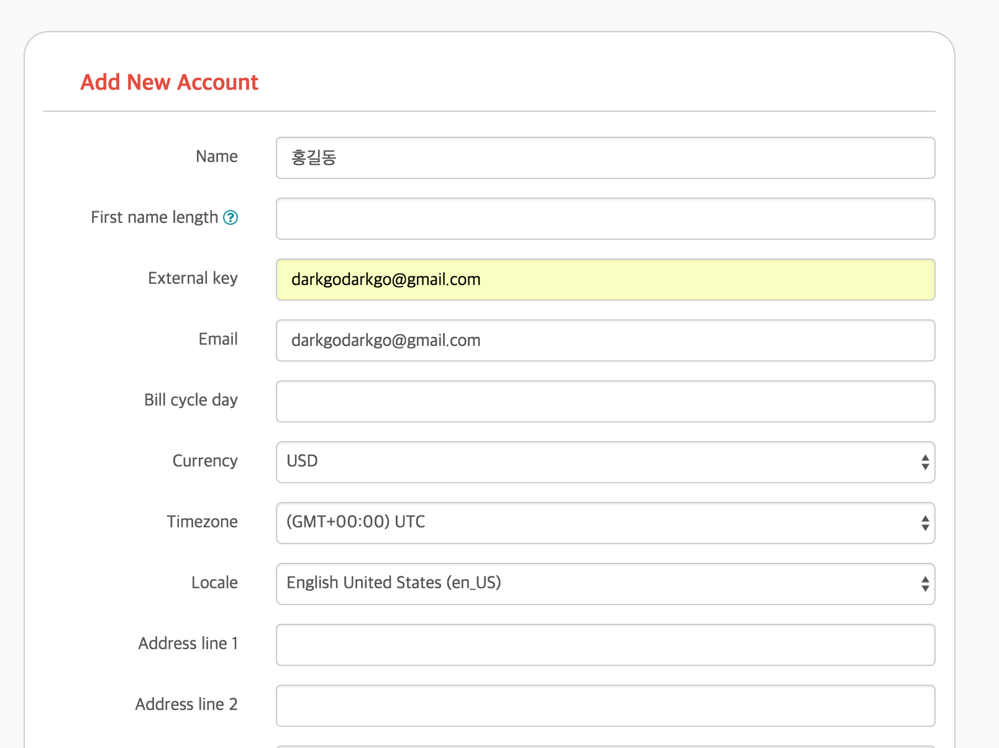
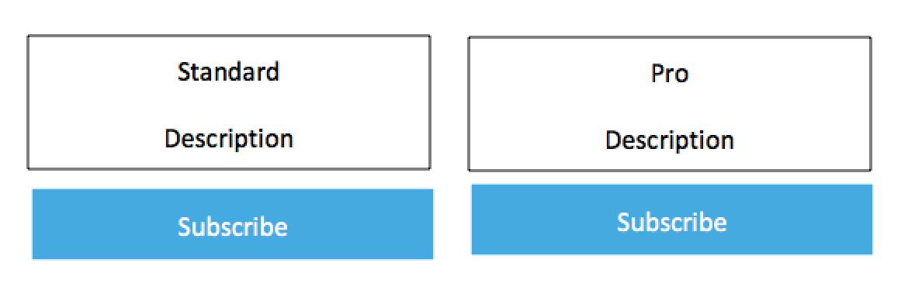
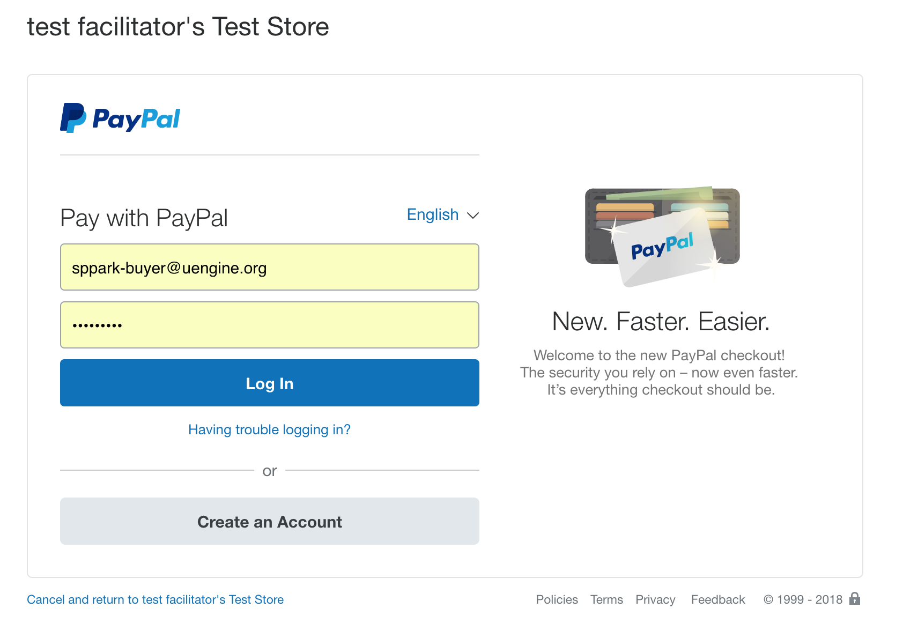
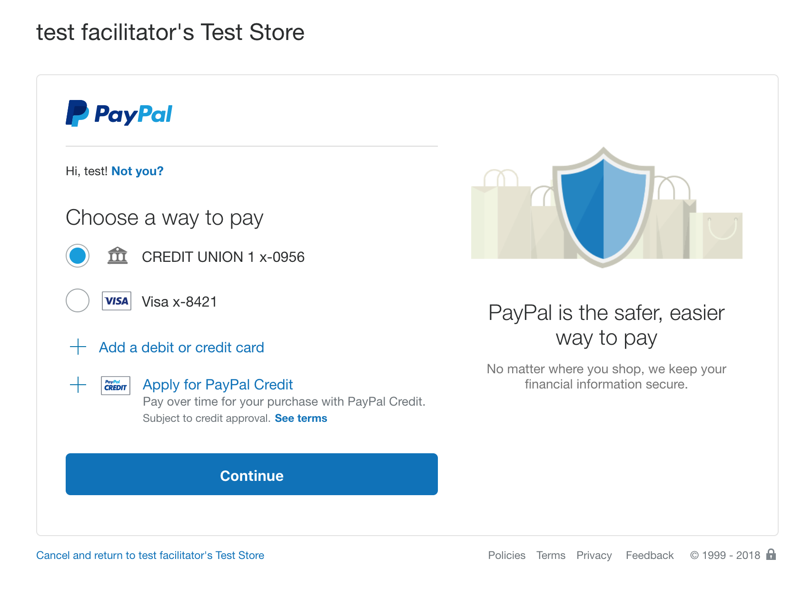
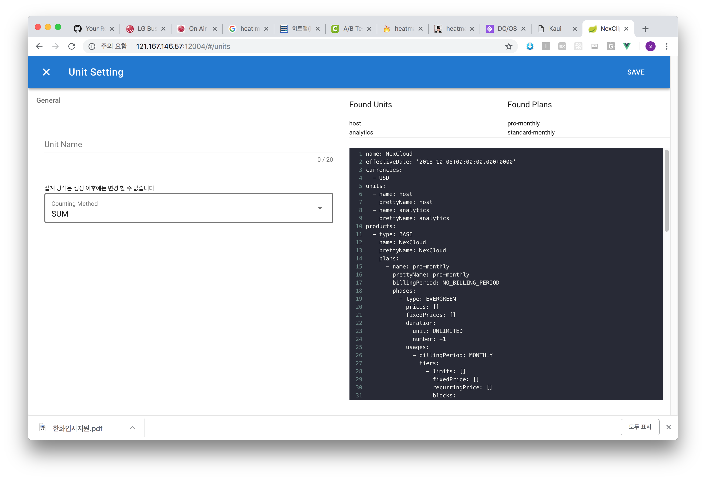
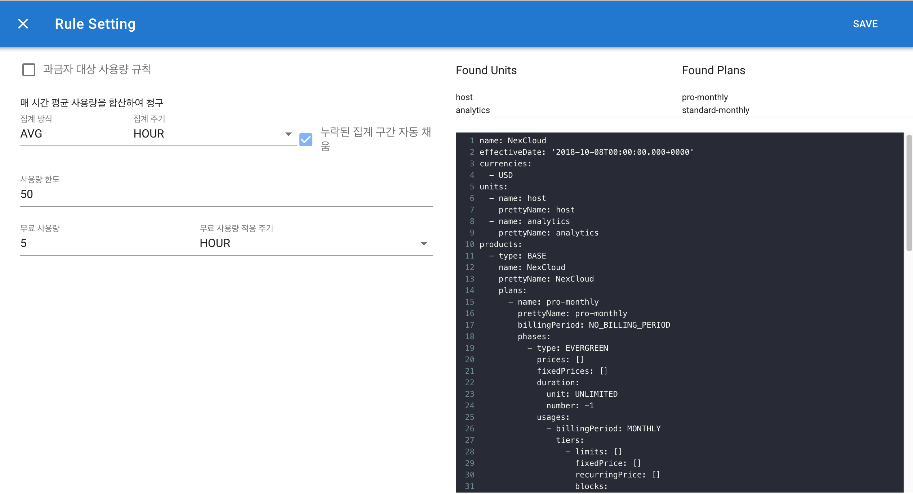

# Paypal Integration

모든 킬빌의 api 는 `http://<killbill-url>/api.html` 에서 swagger ui 를 통해 확인이 가능합니다. 

## 페이팔 세팅

```
curl -v \
     -X POST \
     -u admin:password \
     -H 'X-Killbill-ApiKey: admin' \
     -H 'X-Killbill-ApiSecret: password' \
     -H 'X-Killbill-CreatedBy: admin' \
     -H 'Content-Type: text/plain' \
     -d ':paypal_express:
  :signature: <paypal signature>
  :login: <paypal login>
  :password: <paypal password>' \
     http://<killbill-url>/1.0/kb/tenants/uploadPluginConfig/killbill-paypal-express
```

## Create Test Account

사용자를 등록합니다. `externalKey` 는 어플리케이션에서 운용하는 유저 아이디를 뜻합니다. 킬빌 시스템은 `externalKey` 를 통해서 
유저 아이디로 사용자를 조회할 수 있으며, 생성시 `accountId` 라는 별도의 PK가 생성이 됩니다. 

그 외에, 그림과 같은 필수 값들이 있습니다.



## Application 연동 시나리오

1. 어플리케이션에서 다음과 같은 플랜 선택 페이지를 준비하도록 합니다.



각 Subscribe 버튼 클릭시, 먼저 사용자가 빌링 서비스에 있는지 확인합니다.

```
curl -X GET \
-H "accept: application/json" \
-u admin:password \
-H "X-Killbill-ApiKey: admin" \
-H "X-Killbill-ApiSecret: password \
"http://localhost:9090/1.0/kb/accounts?externalKey=darkgodarkgo%40gmail.com"


{
  "accountId": "21f742f1-ac86-4349-adc2-70cefd075232",
  "name": "test1",
  "firstNameLength": null,
  "externalKey": "darkgodarkgo@gmail.com",
  "email": "darkgodarkgo@gmail.com",
  "billCycleDayLocal": 6,
  "currency": "USD",
  "parentAccountId": null,
  "isPaymentDelegatedToParent": false,
  "paymentMethodId": "ddfe6518-7ce7-4bf7-aa10-2ffd33192aae",
  "referenceTime": "2018-10-06T10:01:20.000Z",
  "timeZone": "Etc/UTC",
  "address1": null,
  "address2": null,
  "postalCode": null,
  "company": null,
  "city": null,
  "state": null,
  "country": "US",
  "locale": "en_US",
  "phone": null,
  "notes": null,
  "isMigrated": false,
  "accountBalance": null,
  "accountCBA": null,
  "auditLogs": []
}
```

사용자가 없다면 추가하도록 합니다.

```
curl -X POST \
"http://localhost:9090/1.0/kb/accounts" \
-u admin:password \
-H "accept: application/json" \
-H "X-Killbill-CreatedBy: nexcloud" \
-H "X-Killbill-ApiKey: admin" \
-H "X-Killbill-ApiSecret: password" \
-H "Content-Type: application/json" \
-d "{ \"name\": \"string\", \"externalKey\": \"string\", \"email\": \"string\", \"currency\": \"USD\", \"locale\": \"en_US\"}"
```

## 사용자 결제 수단

구독을 생성하기 전에, 사용자의 결제수단을 조회하여 봅니다.

**사용자 결제 수단 조회**

```
curl -X GET \
"http://localhost:9090/1.0/kb/accounts/21f742f1-ac86-4349-adc2-70cefd075232/paymentMethods?withPluginInfo=false&includedDeleted=false&audit=NONE" \
-H "accept: application/json" \
-u admin:password \
-H "X-Killbill-ApiKey: admin" \
-H "X-Killbill-ApiSecret: password"

[
  {
    "paymentMethodId": "9fcd4119-f4f9-4ce4-bcf4-d7710fb52826",
    "externalKey": "B-1YA17165KJ4929003",
    "accountId": "ac1d1a3a-0c63-4dc3-8b22-9076861c600f",
    "isDefault": true,
    "pluginName": "killbill-paypal-express",
    "pluginInfo": null,
    "auditLogs": []
  }
]
```

리스트 중에서 pluginName 이 **killbill-paypal-express** 인 것이 없다면, 페이팔을 통해 결제수단을 먼저 추가해줍니다.

먼저 사용자로 하여금 paypal 페이지로 이동시켜, 넥스클라우드 상점에 결제 동의 (Billing Agreement) 를 할 수 있게 해야합니다.
이를 위해서는 paypal 에게 결제 동의창 url 을 요청해야 합니다.

```
curl -v \
     -X POST \
     -u admin:password \
     -H 'X-Killbill-ApiKey: admin' \
     -H 'X-Killbill-ApiSecret: password' \
     -H 'X-Killbill-CreatedBy: meter' \
     -H 'Content-Type: application/json' \
     -d '{
       "kb_account_id": "ac1d1a3a-0c63-4dc3-8b22-9076861c600f",
       "currency": "USD",
       "options": {
         "return_url": "https://dev.nexclipper.com/checkout?q=SUCCESS",
         "cancel_return_url": "https://dev.nexclipper.com/checkout?q=FAILURE",
         "billing_agreement": {
           "description": "Your subscription"
         }
       }
     }' \
     http://127.0.0.1:9090/plugins/killbill-paypal-express/1.0/setup-checkout
     
     
* upload completely sent off: 367 out of 367 bytes
< HTTP/1.1 302 Found
< Location: https://www.sandbox.paypal.com/cgi-bin/webscr?cmd=_express-checkout&token=EC-3RG804787U8574111&useraction=commit     
```

`return_url` 은 결제 성공시 리턴 될 주소이고, `cancel_return_url` 은 결제 실패시 리턴 될 주소입니다.
정상적으로 호출 시 302 메소드가 떨어지고, **Location** 헤더에 주소가 **페이팔에서 발급 해 준 결제 동의창 주소**가 됩니다.

**Location** 헤더 주소로 사용자를 리다이렉트 시켜주셔야 합니다. 리다이렉트 된 사용자는 페이팔 에서 로그인 및 결제 동의를 진행하게 됩니다.





사용자가 동의를 모두 마치면, 페이팔에서는 사용자를 다시 `https://dev.nexclipper.com/checkout?q=SUCCESS&token=EC-4NJ44046FW0594035` 
식으로 **token** 파라미터를 포함하여 리다이렉트 시켜줍니다.

이제 마지막 절차가 남았는데, 킬빌에 아래처럼 요청 할 경우, 킬빌에서는 토큰을 페이팔 측에 **BAID(Billing Agreement Id)** 로 교환하는 작업을 진행 
하고 사용자의 결제 수단으로써 등록을 할 것입니다.

```
curl -v \
     -X POST \
     -u admin:password \
     -H 'X-Killbill-ApiKey: admin' \
     -H 'X-Killbill-ApiSecret: password' \
     -H 'X-Killbill-CreatedBy: admin' \
     -H 'Content-Type: application/json' \
     -d '{
       "pluginName": "killbill-paypal-express",
       "pluginInfo": {
         "properties": [{
           "key": "token",
           "value": "EC-9U2173750U912570F"
         }]
       }
     }' \
     "http://127.0.0.1:9090/1.0/kb/accounts/ac1d1a3a-0c63-4dc3-8b22-9076861c600f/paymentMethods?isDefault=true"
``` 

KAUI 의 해당 Account 화면을 확인하면 다음처럼 결제수단이 추가 된 것을 확인이 가능합니다.

## 사용자 구독 추가 및 구독 변경

사용자의 결제 수단이 추가됬다면, 구독을 생성하거나, 구독을 변경하도록 합니다.

**구독 생성**

```
curl -X POST \
"http://localhost:9090/1.0/kb/subscriptions?renameKeyIfExistsAndUnused=true&migrated=false&callCompletion=false&callTimeoutSec=3" \
-H "accept: application/json" \
-H "X-Killbill-CreatedBy: nexcloud" \
-u admin:password \
-H "X-Killbill-ApiKey: admin" \
-H "X-Killbill-ApiSecret: password" \
-H "Content-Type: application/json" \
-d "{ \"accountId\": \"ac1d1a3a-0c63-4dc3-8b22-9076861c600f\", \"planName\": \"standard-monthly\"}"
```

**구독 변경**

구독 변경에는 기존 구독중인 subscription id 가 필요합니다.

```
curl -X PUT \
"http://localhost:9090/1.0/kb/subscriptions/6f5e055c-99ef-41f1-8594-2fb0105eca68?callCompletion=false&callTimeoutSec=3" \
-H "accept: application/json" \
-H "X-Killbill-CreatedBy: nexcloud" \
-u admin:password \
-H "X-Killbill-ApiKey: admin" \
-H "X-Killbill-ApiSecret: password" \
-H "Content-Type: application/json" \
-d "{ \"accountId\": \"ac1d1a3a-0c63-4dc3-8b22-9076861c600f\", \"planName\": \"standard-pro\"}"
```


# Metering integration 

## Create unit

Visit `http://<Metering-Url>`

Click unit menu, you can see:


Create `host` with Counting Method `AVG`


## Create rule

Click `host` in unit menu -> Click `Add Rule`



Right panel is Killbill Catalog, displaying enable unit and plans.

Left panel is rule.

`과금자 대상 사용량 규칙` 을 선택시 플랜명을 기재해야 합니다. 미선택시 비 과금 사용자에 대한 집계 규칙으로 설정됩니다.

`과금자 대상 사용량 규칙` 미선택 규칙은 unit 당 하나씩만 생성 가능합니다.

---

**AVG/PEAK** 타입인 경우 다음의 설정이 있습니다.

`집계 주기` : 시간당 과금인지, 데일리 과금인지 결정합니다.

`누락된 집계 구간 자동 채움` : 미터링 서비스는 한시간 단위로 타임시리즈 구간을 group by 합니다. 중간에 누락된 타임시리즈가 있을 경우, 
사용자는 꾸준히 서비스를 사용하고 있는데  어플리케이션의 문제로 미터링 서비스로 데이터를 보내지 않을 경우가 있을 수 있는데, 그 경우 앞,뒤 기록을 
참조하여 평균값을 배정하여 과금 할 지 여부입니다.

`사용량 한도` : 별도의 refresh 기간 없이, 지정된 사용량을 넘어서는 미터링 사용량이 감지되면 limit 상태가 되고, 미터링 사용량이 한도 이하 값으로
 들어오면 해제됩니다. Api 를 통해서 임의의 상태로 조정할 수 있습니다.
 
`무료 사용량` : `집계 주기` 와 같은 값이어야 합니다. 시간당 또는 데일리 사용량 중에서, 무료 사용량이 차감된 후 정산됩니다.


**SUM** 타입인 경우 다음의 설정이 있습니다.

`사용량 한도 / 한도 초기화 주기` : 시간당 또는 데일리로 사용량 한도를 지정하고, 지정된 기간동안 사용량이 초과할 경우 limit 상태가 되고, 
초기화 주기 마다 limit 가 해제됩니다. Api 를 통해서 임의의 상태로 조정할 수 있습니다.
 
`무료 사용량 / 초기화 주기` : 시간당 또는 데일리 사용량 중에서, 무료 사용량이 차감된 후 정산됩니다.


## Append Usage Records

미터링 서버로 사용량을 보낼 때는 다음과 같이 보냅니다. 
각 레코드에 time 값이 있다면 특정 시간대로 기록하게 되고, 없다면 현재 시각을 기준으로 사용량이 생성됩니다.

```
curl -X POST \
  http://localhost:8080/meter/record/json \
  -H 'Cache-Control: no-cache' \
  -H 'Content-Type: application/json' \
  -d '[
	{
  "unit": "analytics",
  "user": "tester@gmail.com",
  "amount": 51
},
	{
  "unit": "host",
  "user": "tester@gmail.com",
  "amount": 21
}
	]'
```

**AVG/PAEK** unit 의 사용량을 보낼때는 어플리케이션의 상황에 따라 30분 ~ 한시간 주기로 사용자 별로 amount 를 집계하여 보내면 됩니다. (자주 보낼수록 더 정확해집니다.)

**SUM** unit 의 사용량을 보낼때는 Api gateway 등에서 사용량이 발생할 때 마다 보내면 됩니다.


